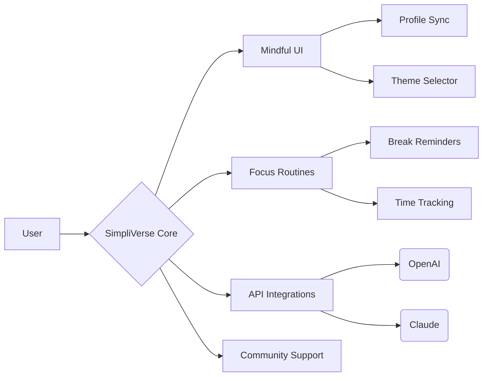

# SimpliVerse  
**DESCRIPTION**:  
SimpliVerse is a minimalist, customizable digital desktop ecosystem built for clarity, calm, and focus. Drawing inspiration from vintage environments, SimpliVerse channels their serenity and streamlines cognitive load. Its purpose is to help anyone—especially neurodivergent individuals—cultivate executive functions in an uncluttered, distraction-reduced world that bridges nostalgia with modern productivity. It’s more than an emulator: it’s a transformative tool for digital mindfulness and purposeful workflow.

---

**⬇️ Download SimpliVerse**  

---

## 🌌 Table of Contents

- [Vision](#vision-light_bulb)
- [Key Features](#key-features-bookmark_tabs)
- [SEO & Accessibility](#seo--accessibility-globe_with_meridians)
- [Installation](#installation-rocket)
- [Supported Platforms](#supported-platforms-desktop_computer)
- [Profile Configuration](#profile-configuration-gear)
- [Console Invocation Example](#console-invocation-example-terminal)
- [API: OpenAI & Claude Integration](#api-openai--claude-integration-robot)
- [Interface Diagram](#interface-diagram-crystal_ball)
- [Disclaimer](#disclaimer-raising_hand)
- [License](#license-scroll)
- [Download Again](#download-again-arrow_down)

---

## 💡 Vision

SimpliVerse proposes a new paradigm in digital productivity: **Intentional Computing**. Instead of layering on features until chaos reigns, SimpliVerse gently guides users to focus by offering only what’s essential. Like a Zen garden for bytes, it wires calm into every click, helping neurodivergent users establish routines, manage information seamlessly, and quiet the static of modern tech.

---

## 📑 Key Features

- **Mindful User Interface:** Minimalist, customizable, and responsive. No clutter, no noise; every pixel has a purpose.
- **Cognitive-Boosting Workflows:** Built-in routines for focus sprints, break reminders, and executive function scaffolds.
- **Multilingual Support:** Localized resources and UI for global accessibility. Languages supported include EN, ES, FR, DE, and more.
- **OpenAI and Claude API Integration:** Invoke generative AI for summarization, guidance, reminders, and text processing directly within your workspace.
- **24/7 Community Support:** Reliable asynchronous support and documentation; dedicated team available every day of the year.
- **Theme Selector:** Includes high-contrast, dyslexia-friendly fonts, and low-stimuli palettes.
- **Profile Sync:** Store, back up, and migrate personal environment profiles securely.
- **Accessibility First:** Keyboard navigation, screen reader compatibility, and large icon modes come standard.
- **Modular Add-ons:** Extend core functionality by connecting lightweight applets.

---

## 🌐 SEO & Accessibility

SimpliVerse is designed for maximum visibility and usability:
- **SEO-rich Documentation:** Discoverable by keyword combinations such as minimalist productivity platform, calm digital workspace, accessible focus tool, and cognitive scaffolding environment.
- **Structured Headings:** Designed for screen readers and optimized search indexing.
- **Alt Text & ARIA Labels:** For inclusive user experience.
- **Metadata Embedded:** For rich previews on search and sharing.

---

## 🚀 Installation

Download the latest SimpliVerse build for your operating system:

**Quick Start:**
1. Unpack the release archive tailored to your system.
2. Run the installer or launch the provided binary.
3. On first launch, follow the guided configuration to create your focus profile.

---

## 🖥️ Supported Platforms

SimpliVerse is cross-platform and optimized for both modern and retro-inspired environments:

| OS                   | CPU Arch     | Supported Version     | Works Out-Of-The-Box |
|----------------------|--------------|----------------------|:--------------------:|
| 🪟 Windows           | x64, ARM64   | 7, 8, 8.1, 10, 11    |       ✅             |
| 🐧 Linux             | x64, ARM32/64| Kernel 4.4+          |       ✅             |
| 🍏 macOS             | x64, arm64   | Mojave 10.14+        |       ✅             |
| 🌍 WebAssembly (WASM)| n/a          | All major browsers   |       ✅             |

---

## ⚙️ Profile Configuration

Here’s a sample `.simpliverse-profile.yaml` for shaping your digital garden:

    username: "sky-traveler"
    preferred_language: "en"
    theme: "low-stimuli-ocean"
    daily_focus_blocks:
      - start: "09:00"
        end: "11:00"
        mode: "Do Not Disturb"
    break_reminder_interval: 30   # minutes
    enabled_modules:
      - notes
      - time-tracking
      - mindful-music
    integrations:
      - openai
      - claude

---

## 🖥️ Console Invocation Example

Launch SimpliVerse from your terminal of choice with:

    simpliverse --profile "/user/sky-traveler/.simpliverse-profile.yaml" --theme "low-stimuli-ocean" --focus-mode

---

## 🤖 API: OpenAI & Claude Integration

SimpliVerse seamlessly integrates with advanced language APIs to:

- Offer contextual productivity suggestions
- Summarize documents and notes
- Generate gentle reminder narratives ("Would you like to take a mindful break?")
- Use voice and text-based prompts for on-the-fly support

**Configuring AI Integrations:**

    ai_integrations:
      openai_token: "<Your-OpenAI-API-Key>"
      claude_token: "<Your-Claude-API-Key>"
      enabled_features:
        - summarization
        - custom reminders
        - task chaining

**AI Function Invocation Example:**

In the SimpliVerse Command Palette:

    /ai summarize meeting_notes.txt

    /ai create_reminder "Drink water" every 60min gentle

---

## 🔮 Interface Diagram

Explore the interconnected simplicity of SimpliVerse below:

---

## ⚡ Feature List

- Distraction-minimized workspace
- Mindful theme gallery (low-stimulus, contrast-rich)
- Focus cycle orchestrator (Pomodoro, Flow, and custom)
- Gentle notification system
- Multi-device sync
- AI-powered concise summaries
- Multilingual interface options
- Open API for modular extension
- Secure profile and setting backups
- Community-driven knowledge base
- Keyboard and screenreader navigation
- Community-first support model
- Seamless migration from other focus tools

---

## 🛡️ Disclaimer

SimpliVerse offers focus and clarity tools, but is not intended as a substitute for clinical therapy or medical advice. All cognitive enhancement features are based on educational research and user preference. For medical or diagnosis-related focus needs, please consult with a professional. Use SimpliVerse as a complement to your self-directed strategies.

---

## 📜 License

This project is licensed under the [MIT License](./LICENSE).  
Copyright &copy; 2026

---

## ⬇️ Download Again

---

*“Serenity is not the absence of technology, but the presence of mindful design.”*  
— The SimpliVerse Ethos